# Maven Prime

[![Version][badge-version]][marketplace]
[![Downloads][badge-downloads]][marketplace]
[![Rating][badge-rating]][marketplace]
[![License][badge-license]][license]

Maven Prime is an IntelliJ IDEA plugin for running Maven, and for finding out what Maven actually did.

A build becomes a saved, editable object instead of a command line you retype. Every report comes from a Maven
extension that runs inside the build and streams structured events back to the IDE, so nothing is guessed from
console text.

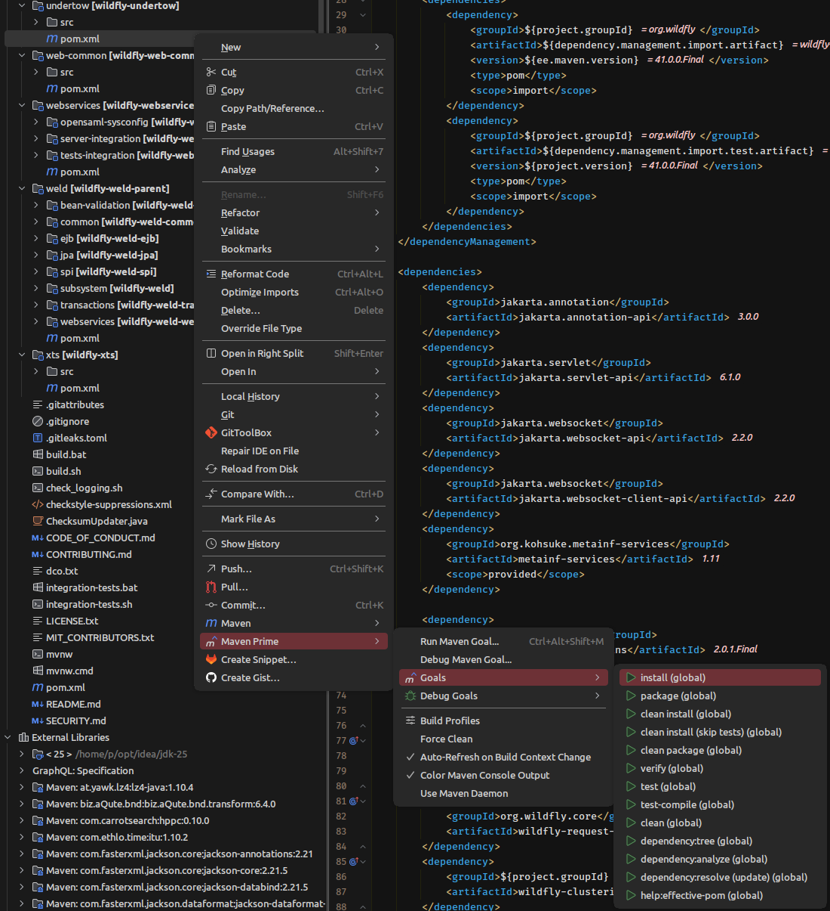

## Features

- **Goals**: saved builds, each one a real IDE action you can bind a shortcut to
- **Build Context**: profiles, properties and environment per project, shareable with the team
- **Navigator**: every module in the reactor, with its lifecycle phases one click from running
- **Tests**: run or debug a single test through Maven, with results in the IDE test tree
- **Profiler**: the critical path of a parallel build, and whether more threads would help
- **Model**: every effective version and property, beside the POM that set it
- **Repository**: what is resolved, missing, half-downloaded or negatively cached in `~/.m2`
- **Dependency Analyzer**: conflicts, every path to an artifact, and why each was kept or dropped
- **Maven Daemon**: detected or installed for you, with `--status`, `--stop` and `--purge` one click away

### Goals

A saved goal is a whole build, not a string: the goals to run, profiles, properties, options, JRE and the Maven
that runs it. Keep it in the global list to get it in every project, or in the project list to keep it with the
project.

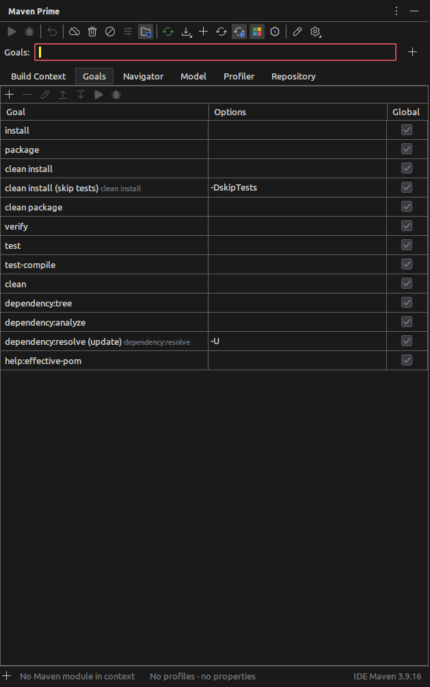

Every saved goal is also a real IDE action. It shows up in **Settings → Keymap** and in the toolbar settings, so
a build you run constantly can have its own shortcut. Renaming it keeps every binding you made.

| Run from | What starts it |
| --- | --- |
| Anywhere | `Ctrl+Shift+Alt+M`, or **Tools → Maven Prime** |
| Project view, editor | the **Maven Prime** context menu |
| IDEA's Maven tool window | **Run with Maven Prime** on the selected phases or goals |
| `pom.xml` | the gutter icon, on `<project>`, a `<plugin>` or a `<goal>` |
| Any run configuration | the **Run Maven Prime Goal** before-launch task |

The module comes from whatever you point at, and the tool window status bar shows which one. Running from the
editor or the gutter creates an ordinary run configuration, so it is rerunnable and editable like any other.

**Force Clean**, **Skip tests** and **Offline** change what a goal does without editing the goal.

### Build Context

One place holds what every build in this project starts from: the Maven that runs it, the settings file, the
JRE, the VM options, the active profiles and the user properties. Switching a whole project to `mvnd` is one
change.

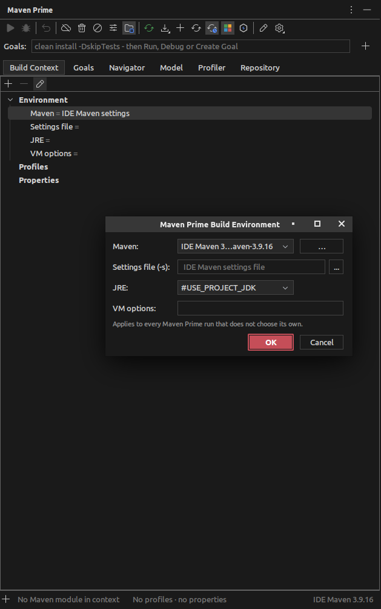

`.mavenprime.json` at the reactor root shares that with your team, with a JSON schema for completion. It is
never written on your behalf. **Create .mavenprime.json**, on the Maven settings wheel or in the Maven Prime
settings, writes out what you have; until it exists your goals and build context stay with the project under
`.idea`. Once the file is there it is read live, so pulling a teammate's change is the whole of the change.

Your machine always wins. A value you never touched follows the team's edits, one you changed is never
overwritten, and each row says which it is. **Reset to Defaults** puts you back on the team's values.

### Two engines, one build

Two engines run a Maven build, Maven itself and the `mvnd` daemon, and four ways to pick which one and which
copy of it:

| Distribution | What runs it |
| --- | --- |
| Build context | whatever the project's context says |
| IDE Maven settings | IDEA's own Maven configuration: same JDK, VM options, settings files |
| Maven home | the Maven installation you name |
| Maven Daemon (mvnd) | the `mvnd` client, with the build tree in the Build tool window |

The daemon is found on `MVND_HOME`, the `PATH`, SDKMAN and the usual install locations, or downloaded and
installed for you against its published SHA-512. Debugging is not something a daemon does, so a Debug on mvnd
runs on the Maven embedded in it, at the same version, and says so.

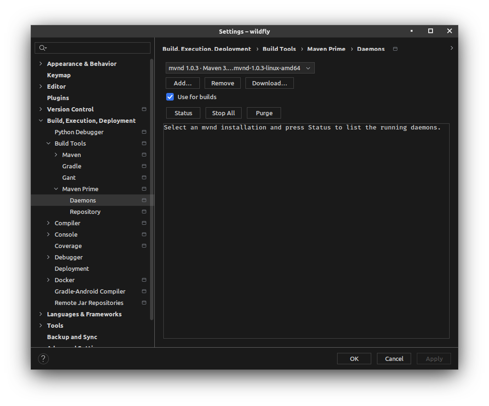

### Navigator

Every module in the reactor, each with its lifecycle phases underneath, from `clean` through `deploy`. Any phase
runs or debugs straight from the tree, on the module it sits under, without typing it or saving a goal for it.

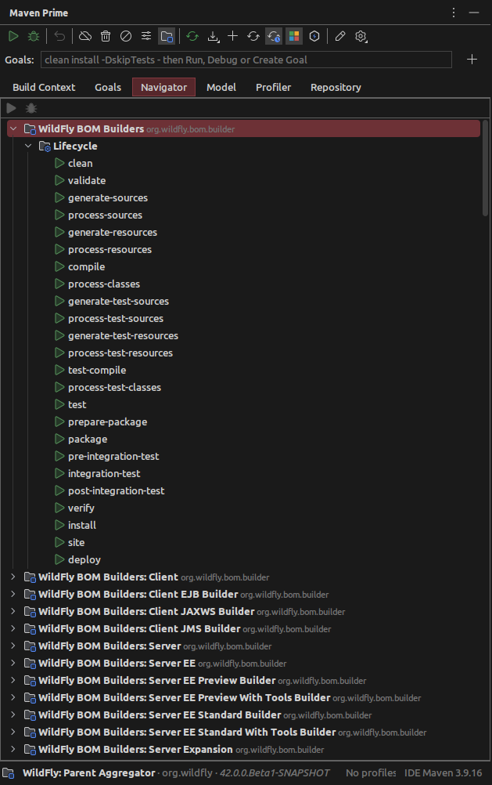

### Tests

**Run Test with Maven Prime** and **Debug Test with Maven Prime** sit in the run gutter, next to the IDE's own
runners. The test under the cursor becomes `test -Dtest=…` on the module that owns the file.

Results come from the Surefire and Failsafe reports the build actually wrote, so a run through Maven fills the
test tree the way a run through the IDE does. Debug attaches to the JVMs Surefire forks, so breakpoints are hit
instead of being skipped in a child process.

### In the POM editor

A `${property}` shows what the effective model resolved it to, in a version tag or anywhere else in the POM, and
a dependency or plugin with no version shows the one it inherits from dependency or plugin management. Clicking
the value opens the file and line that declares it, parent POMs included.

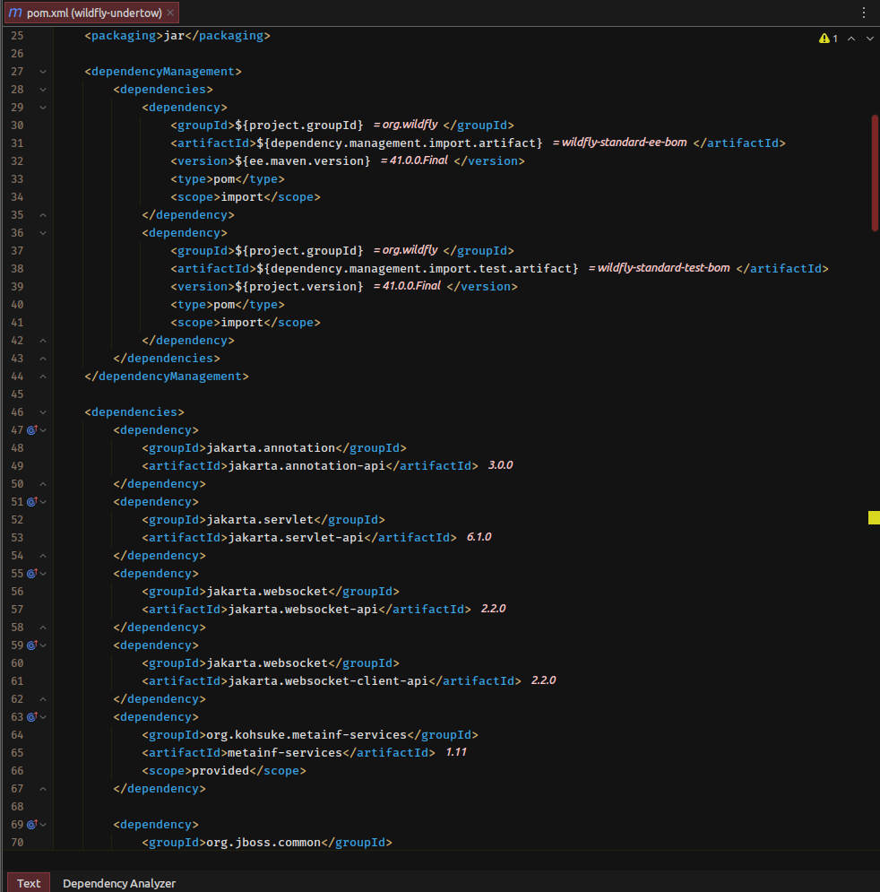

**Intentions** on the same file analyze a dependency, go to the declaration that sets its version, or exclude a
transitive.

### Dependency Analyzer

A tab on every `pom.xml`, working on the tree the IDE already resolved, so there is no waiting.

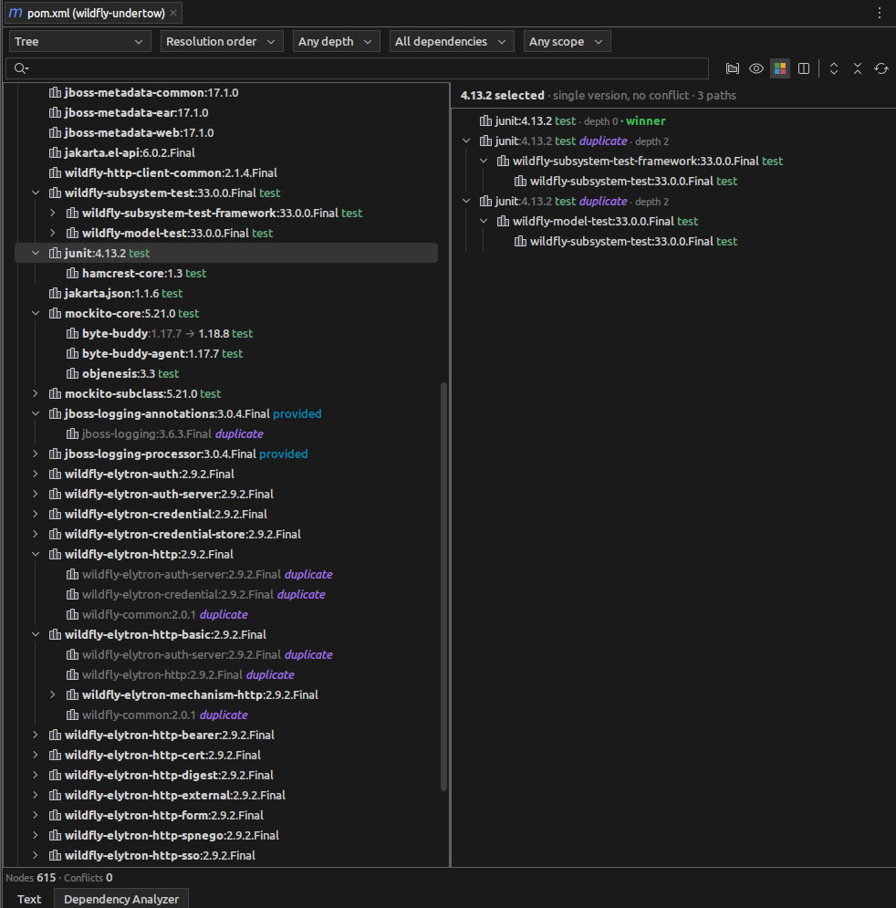

- **Conflicts**: every artifact resolved to more than one version, and the version that won
- **Why this version**: every path that brings an artifact in, each with the reason it was kept or dropped
- **Exclude Dependency**: writes the `<exclusion>` into the declaration that brings it in, and tells you when
  that declaration lives in a parent
- **Inspect in Local Repository**: hands the artifact to the Repository tab, which is usually the next question

### Profiler

Maven tells you how long each module took, which is the wrong number for a parallel build. The total is set by
the critical path through the reactor, not by the sum.

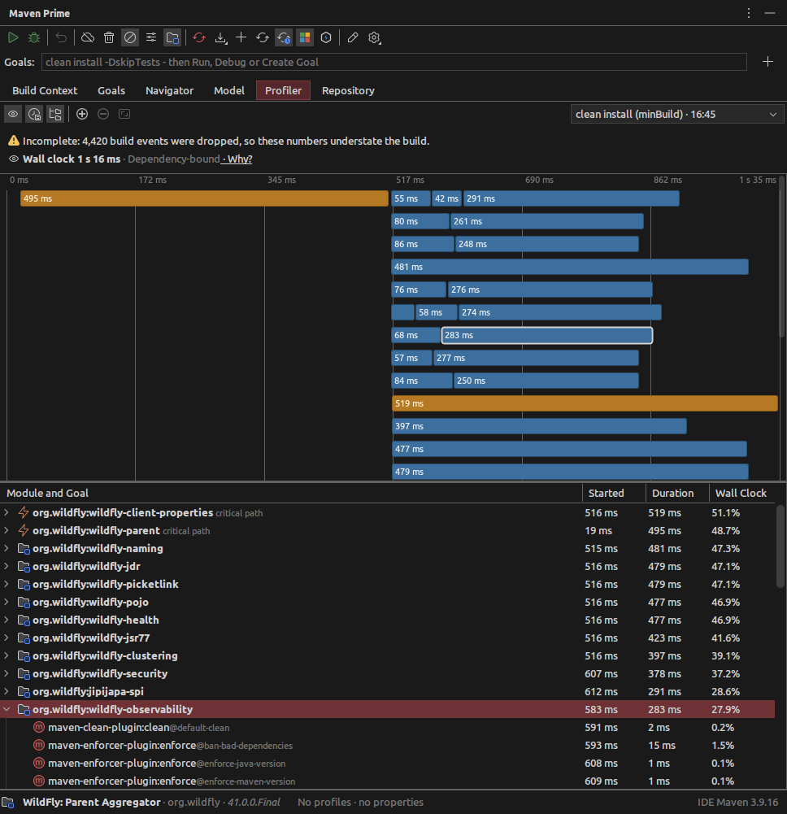

The **Profiler** tab draws the build as a timeline, one lane per module that actually ran at the same time, and
then tells you which of three things you are looking at:

- **Dependency-bound**: no thread count helps. Shorten a module on the critical path, which is listed for you.
- **Thread-starved**: the graph allows more parallelism than the build used. You get the `-T` value worth
  raising to, and the time it could recover.
- **Sequential**: nothing ran in parallel, and the `-T` value the reactor would allow if you tried.

Time lost to scheduling is reported separately, so it is never confused with time lost to thread count.

### Model

Where did that version come from? The **Model** tab answers it from Maven's own effective model: every
dependency, build plugin and property of the module, beside the POM that actually set it.

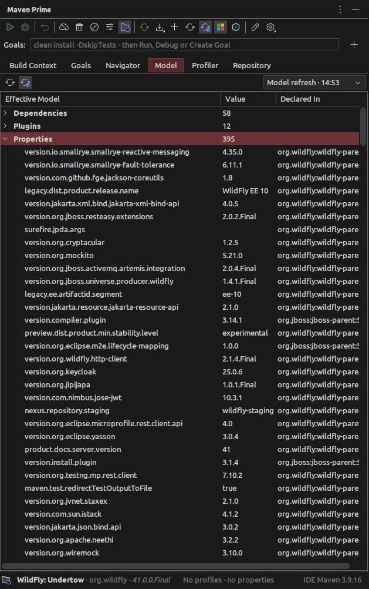

Double-click goes to that file at that line, including parents that only exist in `~/.m2`. Plugins you never
declared are listed too, with the model that injected them.

**Refresh Model** fills the tab on its own. **Auto-Refresh on Build Context Change** re-reads it whenever a
profile, a property or the environment changes underneath you.

### Repository

`was cached in the local repository, resolution will not be reattempted` is a sentence about files on disk that
nothing reads for you. The **Repository** tab reads them, and only touches the network when you ask.

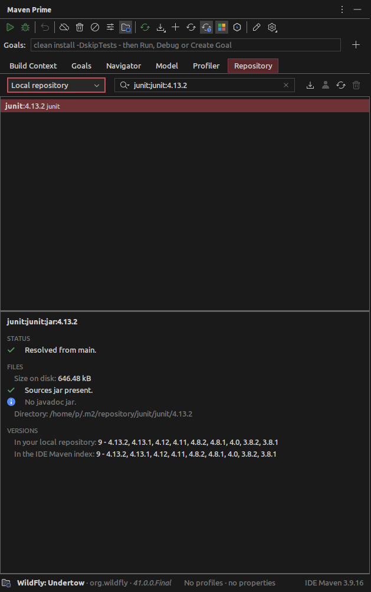

Type `commons-lang3` to find it; full coordinates are optional. You can search the local repository, the
repositories the IDE has indexed, the module's dependencies or plugins, or what a build actually downloaded and
failed to resolve.

For the artifact you pick:

- whether it is resolved, never fetched, **not found**, or a **transfer failure**, a distinction Maven records
  but never shows you
- which repository it came from, every repository tried, and when
- whether the **sources** and **javadoc** jars are really on disk, the real answer to why the IDE shows you no
  sources
- what it takes up, and every other version you already have locally
- **Purge Negative Cache**, which deletes that one artifact's `.lastUpdated` markers so the next build retries,
  instead of deleting `~/.m2`

Published versions appear without asking, so you see whether a newer one exists the moment you select an
artifact. **Check Remote Repositories** is the second opinion when the index is stale, asking the repositories
your build actually resolves against. Credentials come from your `settings.xml`, and **Set Repository
Credentials** stores anything extra in the IDE password safe.

From any row you can open the POM, jump to the declaration, add it as a dependency, analyze it, reveal it in
your file manager, or copy its coordinates.

### Not just the last build

The Profiler, Model and Repository tabs keep recent builds, not only the newest. Pick an earlier one and its
timings, provenance and downloads come back. The run that failed differently is a pick away, not a rerun.

### Maven 4 aware

Options are rendered for the version that will actually run. An option the installed Maven does not accept is
dropped and reported, never sent.

## Installation

- **From JetBrains Marketplace**: <kbd>Settings</kbd> > <kbd>Plugins</kbd> > <kbd>Marketplace</kbd> >
  <kbd>Search for "Maven Prime"</kbd> > <kbd>Install</kbd>.
- **From the Marketplace website**: open [the plugin page][marketplace] and press <kbd>Install to IDE</kbd>.
- **From disk**: download the archive from [the latest release][releases], then <kbd>Settings</kbd> >
  <kbd>Plugins</kbd> > <kbd>⚙️</kbd> > <kbd>Install Plugin from Disk…</kbd>.

## Compatibility

IntelliJ IDEA 2024.3 or newer, Community or Ultimate. Maven comes from the IDE, so there is nothing else to
install. `mvnd` is optional and only needed for daemon builds.

The Profiler, and the Repository tab's resolution failures and downloads, come from a Maven Prime build on
either engine, since they report what Maven did rather than what the IDE assumes. The Model tab fills from
**Refresh Model** on its own, and the rest of the Repository tab reads your disk and the IDE's index with no
build at all.

## Configuration

**Settings → Build, Execution, Deployment → Build Tools → Maven Prime**, next to IDEA's own Maven page, with
child pages for **Daemons** and **Repository**. Global goals and project goals are edited here as well.

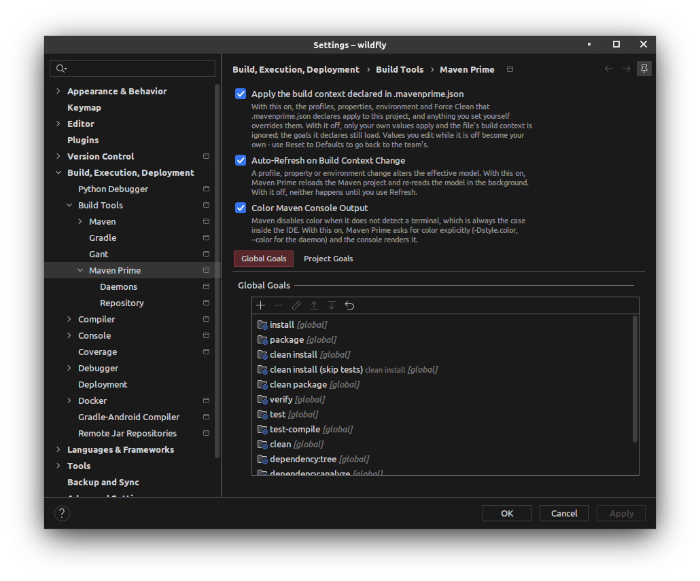

## Building from source

```shell
./gradlew build          # compiles, runs the tests, builds the plugin
./gradlew verifyPlugin   # verifies against 2024.3 and 2026.2
./gradlew runIde         # a sandbox IDE with the plugin installed
```

The build runs on a Java 21 toolchain and provisions it through the foojay resolver, so no local JDK setup is
needed.

## Contributing

Issues and pull requests are welcome at [the issue tracker][issues]. Run `./gradlew build` before opening a pull
request: it compiles with `-Werror`, runs both test suites and packages the plugin.

## License

Apache License 2.0. See [LICENSE.txt][license].

<!-- Replace PLUGIN_ID below with the numeric JetBrains Marketplace id once the listing is live. -->
[marketplace]: https://plugins.jetbrains.com/plugin/PLUGIN_ID
[badge-version]: https://img.shields.io/jetbrains/plugin/v/PLUGIN_ID.svg?label=version
[badge-downloads]: https://img.shields.io/jetbrains/plugin/d/PLUGIN_ID.svg
[badge-rating]: https://img.shields.io/jetbrains/plugin/r/rating/PLUGIN_ID.svg
[badge-license]: https://img.shields.io/badge/license-Apache--2.0-blue.svg
[releases]: https://github.com/bitstrings/maven-prime/releases/latest
[issues]: https://github.com/bitstrings/maven-prime/issues
[license]: LICENSE.txt
